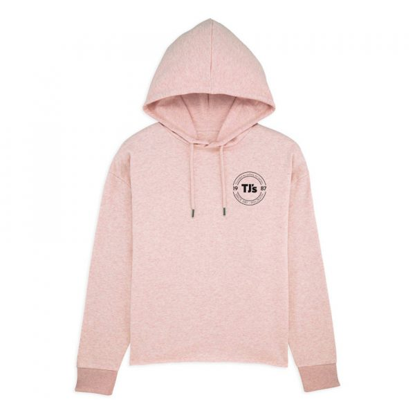
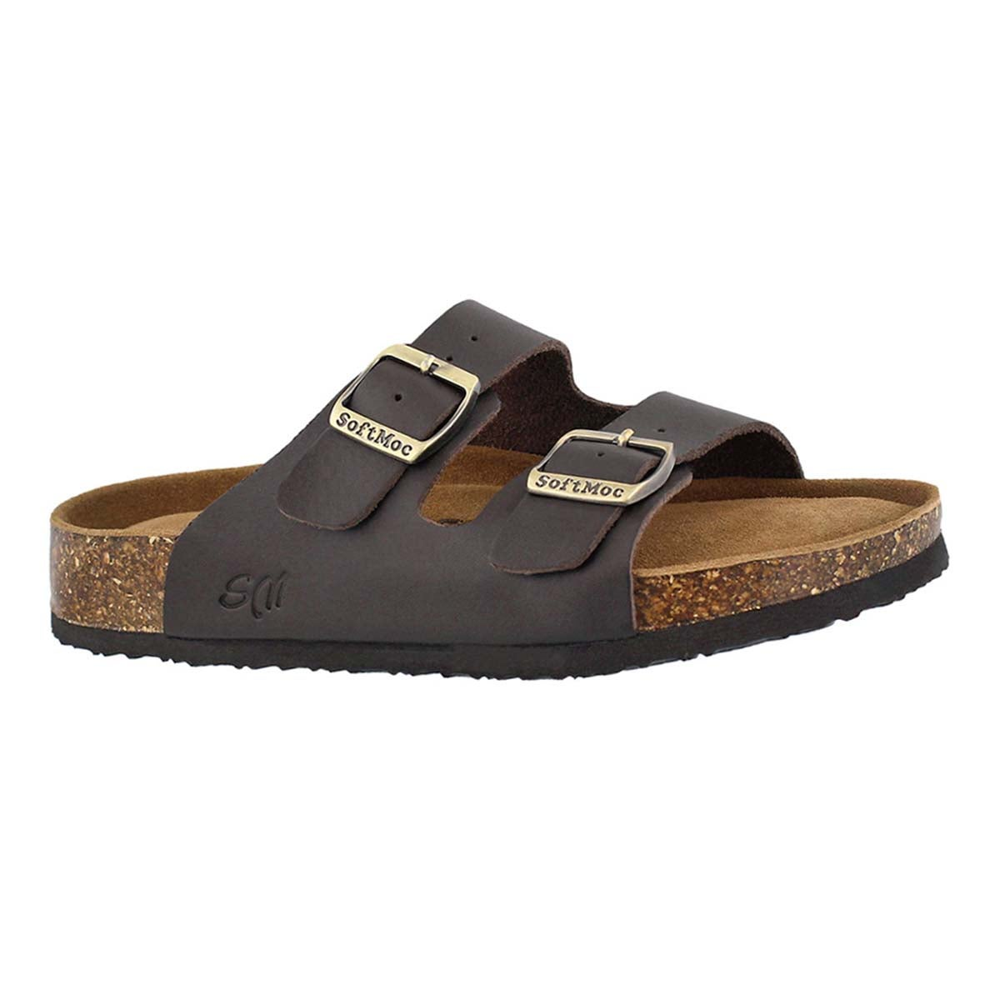
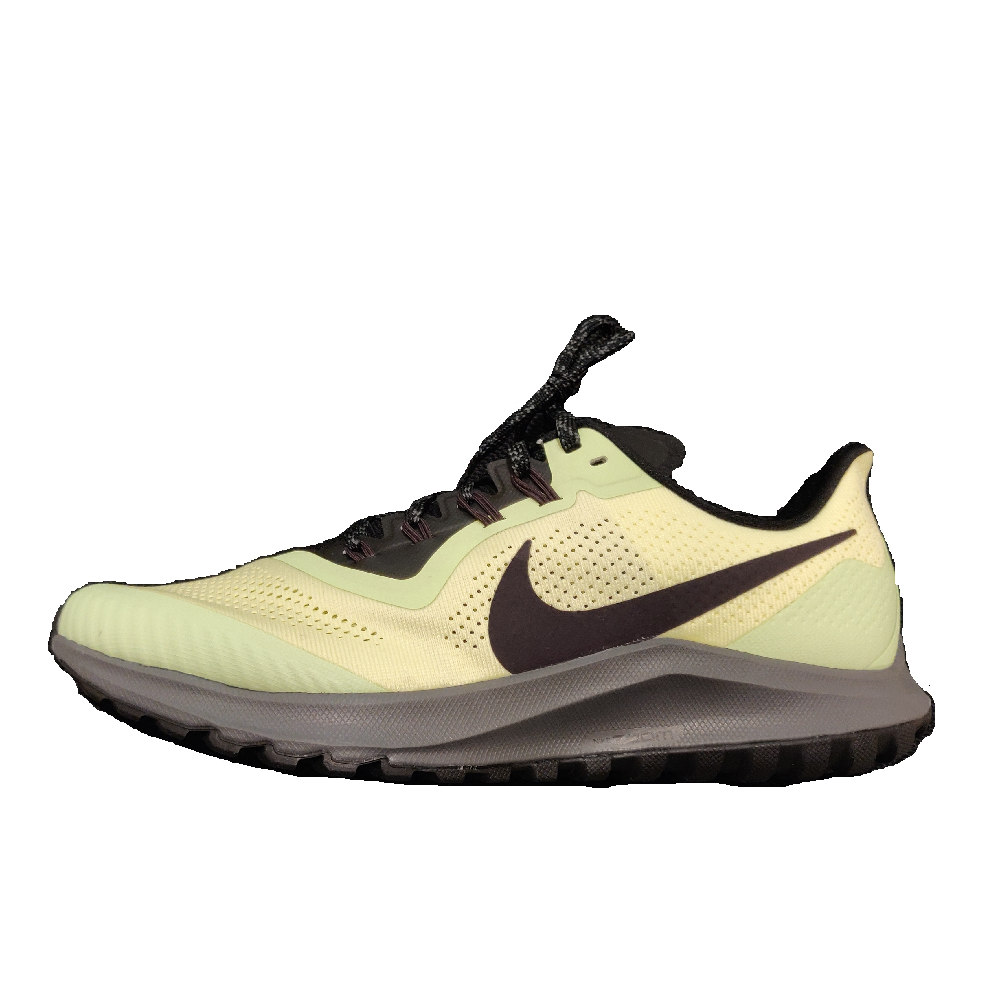
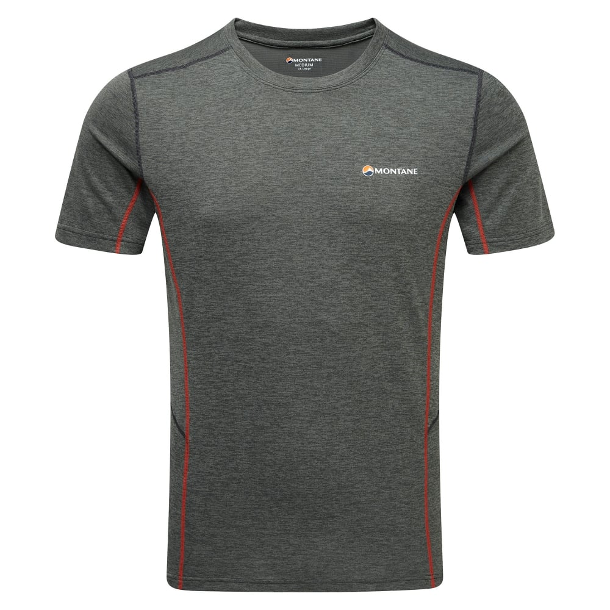
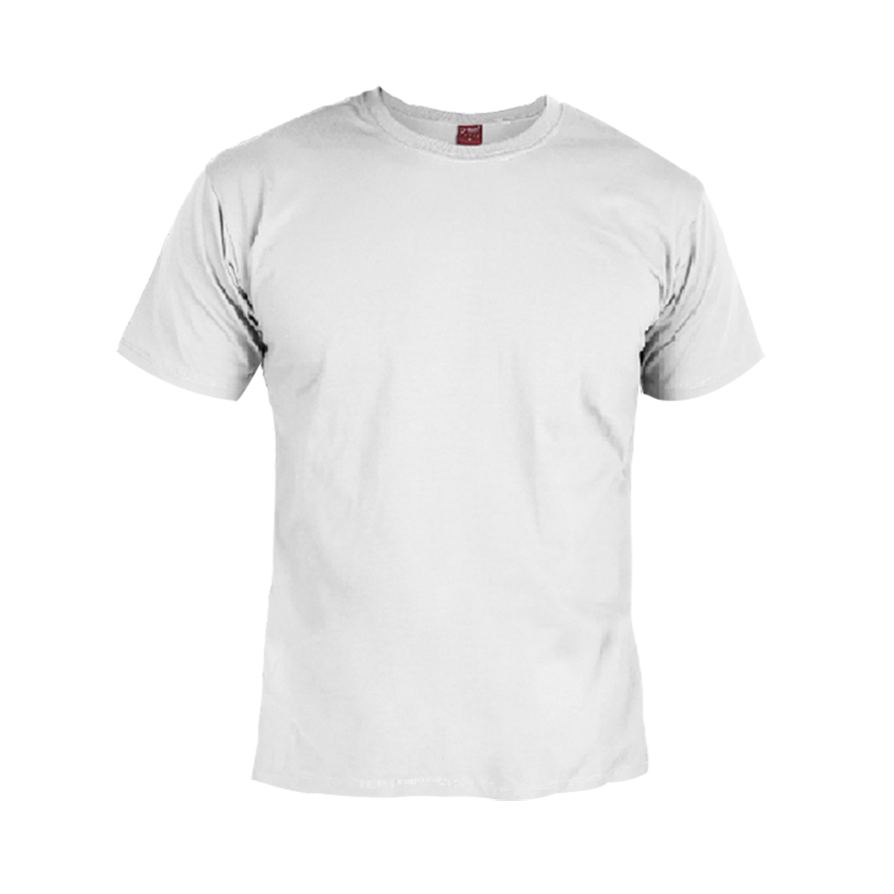
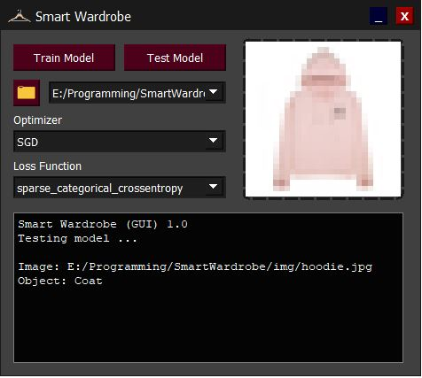

# Smart Wardrobe

## Overview
***Smart Wardrobe*** detects and categorizes clothing into one of 10 groups:  
- T-Shirt/Top
- Trousers
- Pullover
- Dress
- Coat
- Sandals
- Shirt
- Sneakers
- Bag
- Ankle Boots

## Command Line Mode
Command line mode can be used to train the model, test the model using images in the img directory, or display the images in the img directory.
```
$ python SmartWardrobe.py

Enter command> help

COMMANDS
        train                   train dataset
        test                    predict images in img folder
        display [FILE NAME]     display image file
```
### Training
The model is trained using a **multi-layered neural network** in **Tensorflow** and **Keras.**
```
model = tf.keras.models.Sequential()
model.add(tf.keras.layers.Flatten())
model.add(tf.keras.layers.Dense(784, activation = tf.nn.relu))
model.add(tf.keras.layers.Dense(196, activation = tf.nn.relu))
model.add(tf.keras.layers.Dense(10, activation = tf.nn.softmax))
...
model.compile(optimizer = optimizer, loss = lossFunction, metrics = ["acc", "mse"])
...
history = model.fit(x_train, y_train, epochs = epochsCount)
```
Optimizing using **stochastic gradient descent,** using a **sparse categorical entropy** loss function and with 3 epochs the accuracy stands at roughly **73%.**
```
$ python SmartWardrobe.py

Enter command> train
...
Epoch 1/3
1875/1875 [==============================] - 13s 7ms/step - loss: 1.8391 - accuracy: 0.5231
Epoch 2/3
1875/1875 [==============================] - 18s 10ms/step - loss: 1.0088 - accuracy: 0.6804
Epoch 3/3
1875/1875 [==============================] - 23s 12ms/step - loss: 0.7522 - accuracy: 0.7375
```

### Testing
```
$ python SmartWardrobe.py

Enter command> test

1). hoodie.jpg is an image of a COAT

2). sandal.jpg is an image of SNEAKERS

3). shoe.jpg is an image of ANKLE BOOTS

4). tshirt.jpg is an image of a T-SHIRT/TOP

5). tshirtwhite.jpg is an image of a COAT
```
  
hoodie.jpg  
  
  
sandal.jpg  
  
  
shoe.jpg  
  
  
tshirt.jpg  
  
  
tshirtwhite.jpg  

## GUI Mode
Built with **PyQt5,** the GUI supports the same functionality as the command line mode and more. In addition to testing images in the img directory, the GUI allows the testing of any other images. The GUI also allows selection of the loss function, the optimizer, and has a built-in terminal and image display.



## Dataset
The [Fashion-MNIST](https://www.kaggle.com/zalando-research/fashionmnist) dataset was used for training.